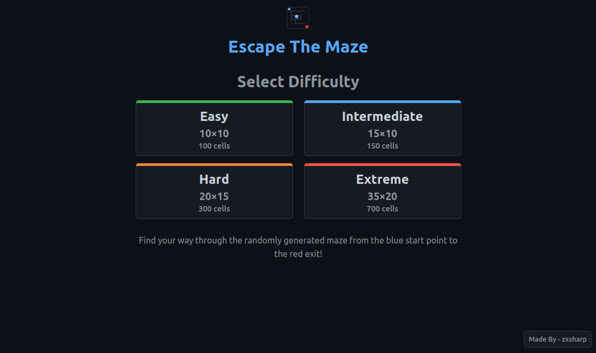
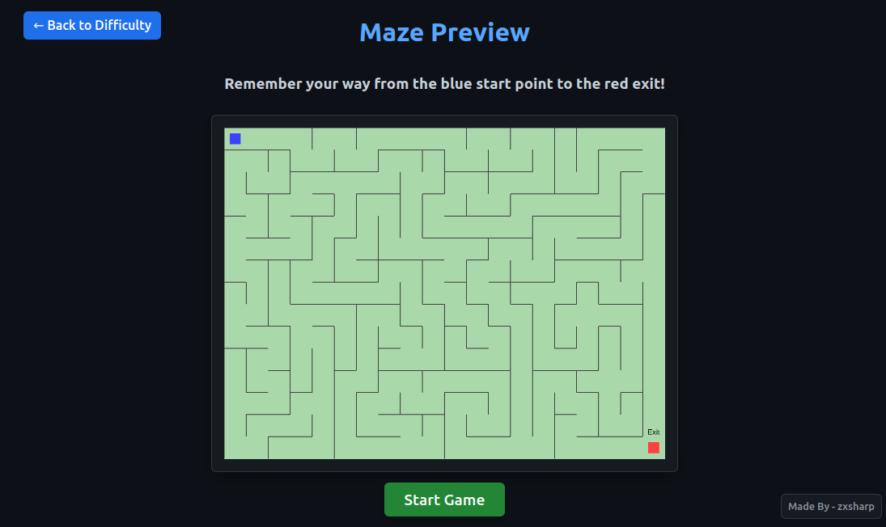
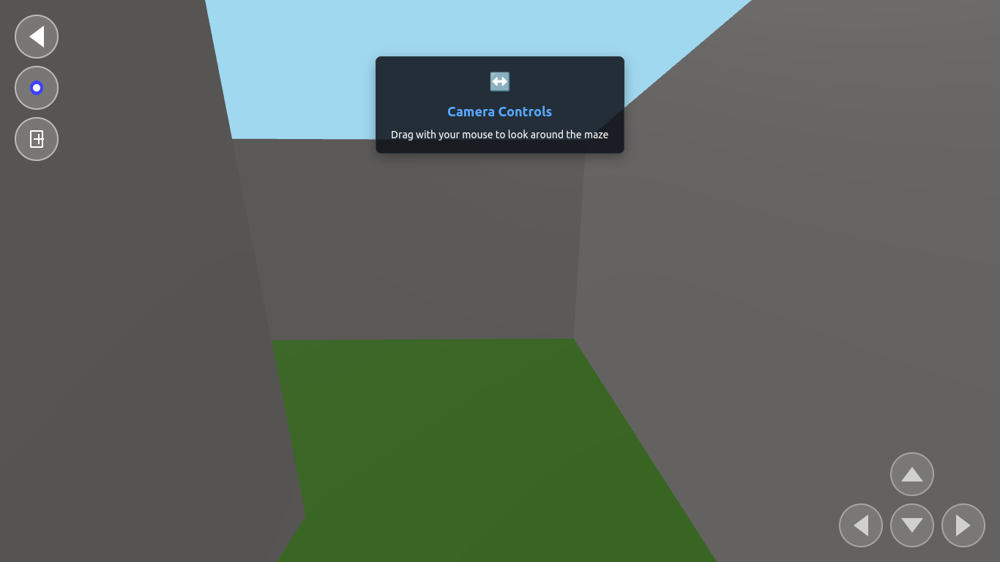
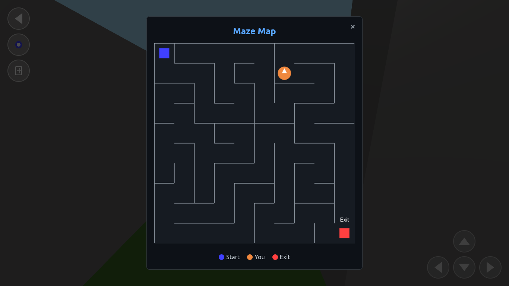
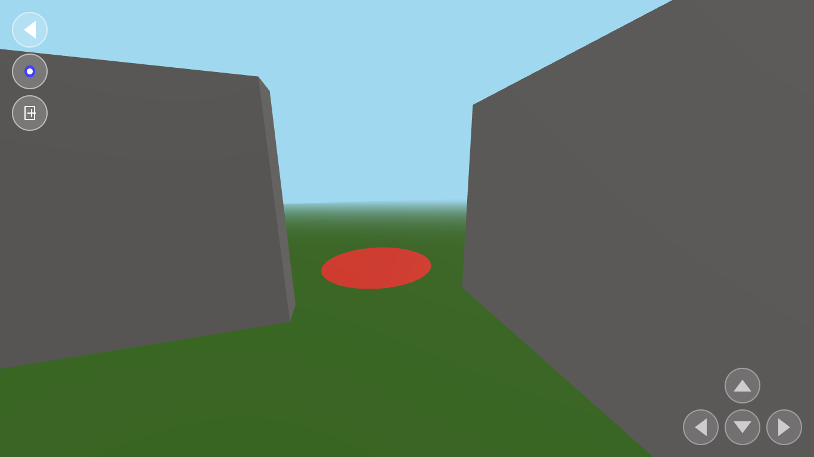

# Escape The Maze

## [Play Now: escapeit.vercel.app](https://escapeit.vercel.app)

## Overview
Escape is a 3D game where player can navigate through a maze to find the exit. You're first shown a 2D map of the maze and you have to remember your path in 3D world.

## Features
- First-person 3D navigation
- Random Maze generation for each turn ensures there is always a single unique path from start to end. ([text](https://en.wikipedia.org/wiki/Maze_generation_algorithm))

## How to Play
1. Use WASD or arrow keys to move through the maze
2. Navigate through corridors and rooms to find the exit
3. Avoid dead ends and backtrack

## Screenshots

### Difficulty Levels

### Maze Preview

### Maze Entrance

### Cheat Map

### Maze Exit

## Controls
- **W/↑**: Move forward
- **A/←**: Move left
- **S/↓**: Move backward
- **D/→**: Move right
- **Mouse**: Click and drag to rotate camera view

## Technologies Used
- Three.js for 3D rendering
- JavaScript for game logic
- HTML5 and CSS3 for UI elements
- Web Audio API for sound effects

## Development
I made this game as a project to explore 3D rendering on browsers.

## Feedback and Contributions
Feel free to provide feedback or contribute to the project by submitting issues or pull requests on our GitHub repository.

